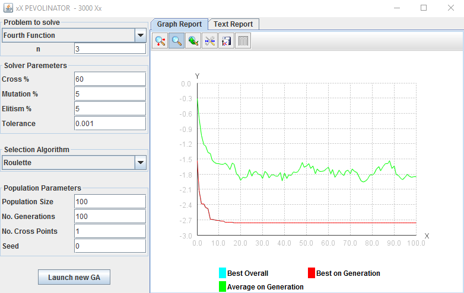
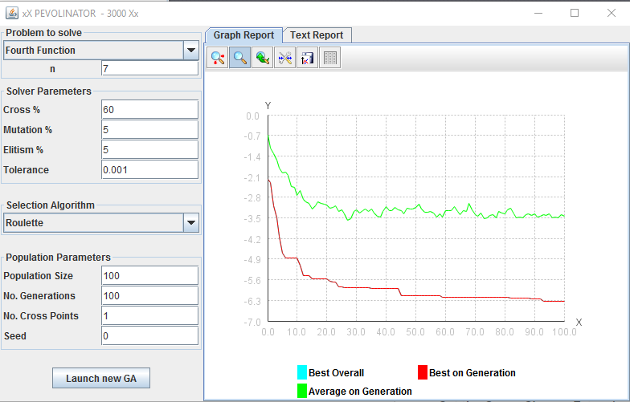
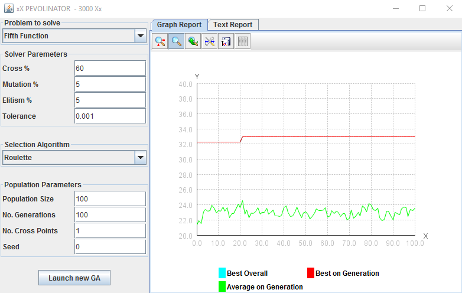

PEVOLINATOR - 3000
===============
Pedro García Castillo, Borja Lorente Escobar

Aplicación
---------


### Instrucciones de uso (Hints):
Hemos añadido los valores predefinidos para cada uno de los campos de la interfaz mediante un sistema de Hints. Estos campos a la vez guardan el último valor introducido pero lo ocultan cuando hacemos click para cambiar dicho valor pero sin perderlo si dejamos de escribir en un campo sin haber introducido ningún valor este recuperará su ultimo valor.

### Elitismo
Uno de las diferencias en nuestra aplicación con respecto a la que se nos mostró en clase es el funcionamiento del elitismo. Pensamos que sería mas interesante poder elegir el porcentaje del elitismo mas que simplemente poder decir si se quiere elitismo o no. En caso de no querer elitismo simplemente hay que poner 0 para que el porcentaje de la elite guardado en cada iteración sea 0.

### Funcionamiento de la seed
Nuestro programa tiene la posibilidad tanto de usar una seed para crear la población inicial como de que dicha seed sea un número aleatorio. Para ello en la interfaz hemos añadido un campo Seed el cual si recibe el valor cero usara una seed aleatoria y si recibe cualquier otro valor utilizará dicho valor como seed. En ambos casos la seed se utiliza solo para la población inicial que para la misma seed siempre será la misma.


## Estructura

### Representación de individuos

En nuestra aplicación, un `Individuo` es una clase con un `Genoma` y valores absolutos y desplazados de fitness. Un `Genoma` es un contenedor de `Gene`s, los cuales pueden tener cualquier representación interna, pero todos deben devolver sus valores como `double`, `int` o `boolean[]` (binario). Así, se consigue que el `Individuo` tenga capacidades muy convenientes como el constructor copia o la capacidad de cruzarse con otro individuo, sin tener que saber sobre la implementación interna de los `Gene`s.

### Arquitectura de funciones de fitness

Cada `Individuo` debe poder calcular sus valores de aptitud absoluta y desplazada, preferiblemente de una forma independiente a la función en concreto que se quiere optimizar usando polimorfismo. Para ello, hemos creado la clase abstracta `Fitness` (`src/model/solvers/fitness/Fitness.java`), la cual define funciones para calcular el desplazamiento y la aptitud, además de una serie de wrappers sobre la librería `Math`, por conveniencia. Las funciones que queremos optimizar, así como si el problema es de maximización o minimización, estarán codificadas en subclases de `Fitness`.

Dado que estas suclases solamente contienen funciones puras (sin estado), y que vamos a necesitar datos concretos sobre el problema que están fuertemente atados al enunciado (como los máximos y mínimos de cada variable del genoma), hemos creado la clase `FitnessFunctionData` que contiene instancias estáticas precreadas de las subclases correctas. Esta clase expone una interfaz similar a los `enum` en Java, pero permite guardar atributos adicionales en cada instancia, como el tamaño del genoma. Esta técnica se describe en _Effective Java_, de _Joshua Bloch_.


### Localización de algoritmos de cruce, selección

Los algoritmos de selección siguen el mismo patrón de diseño que las funciones de fitness, y se pueden encontrar en `src/model/solvers/selection/`.

En cuanto a los algoritmos de cruce, lo hemos implementado de forma que acepte n puntos de corte, por lo que solamente hace falta una clase.

### Implementación de elitismo

Para implementar el elitismo, hicimos que una `Población` pudiera devolver una nueva `Población` conteniendo los n mejores individuos, donde n es el porcentaje de elitismo pasado como parámetro multiplicado por el tamaño de la población, redondeado hacia arriba. También implementamos la funcion inversa, por la cual una población descarta sus n peores individuos. Por último, creamos una función por la cual una población copia todos los individuos de otra población a sí misma. En definitiva, el algoritmo de elitismo se incluyó como sigue:

```java
for (int i = 0; i < generaciones; i++) {
  Poblacion elite = poblacion.guardaMejores(0.05); // Guarda el 5% mejor
  // Seleccion, cruce y mutacion
  poblacion.descartaPeor(0.05);
  poblacion.copiaTodos(elite);
}
```

## Métodos y algoritmos utilizados

### Código de seleccionadores

Implementamos todos los seleccionadores requeridos, cuyo código se muestra en los siguientes archivos, en su implementación de la función `Population select(Population)`:

- Ruleta: `src/model/solvers/selection/Roulette.java`
- Torneo Determinista: `src/model/solvers/selection/DeterministicTournament.java`
- Torneo Probabilista: `src/model/solvers/selection/ProbabilisticTournament.java`
- Universal Estocástico: `src/model/solvers/selection/UniversalStochastic.java`

### Código del cruce
A continuación se encuentra el código de cruce para n puntos de corte. Algunas de las funciones se han dejado fuera de este ejemplo, pero el código completo se puede encontrar en `src/model/solvers/cross/CrossAlgorithm.java`:

```java
public Population cross(Population population) {		
  Population crossed = new Population();
  List<Individual> pop = population.getPopulation();
  Individual selected = null;
  boolean readyToPair = false;
  for (Individual ind : pop) {
    if (selected()) {
      if (readyToPair) {
        List<Individual> children = crossPair(ind, selected);
        for (Individual child : children) {
          crossed.addIndividual(child);
        }
        readyToPair = false;
        selected = null;
      } else {
        selected = ind;
        readyToPair = true;
      }
    } else {
      crossed.addIndividual(ind);
    }
  }

  if (readyToPair) {
    crossed.addIndividual(selected);
  }		

  return crossed;
}

private List<Individual> crossPair(Individual ind, Individual selected) {
  int genomeSize = ind.getGenome().totalSize();
  List<Individual> children = new ArrayList<>();
  SortedSet<Integer> crossIndices = new TreeSet<>();
  for (int i = 0; i < numPoints; i++) {
    crossIndices.add(newCrossPoint(crossIndices, genomeSize));
  }

  ind.crossSelf(selected, crossIndices);
  children.add(ind);
  children.add(selected);
  return children;
}
```

### Código de la mutación
Como el proceso en concreto de mutación depende de la representación interna de los genes, decidimos que cada `Gen` debería ser capaz de mutarse a sí mismo. Un ejemplo de dicha mutación, para genes representados como listas de binarios, es la siguiente:

```java
@Override
public void mutateSelf(double mutationPercent, Random seed) {
    for (int i = 0; i < size; i++) {
        bits[i] = seed.nextDouble() < mutationPercent;
    }
}
```

## Fotos de las gráficas

First function:    


Second function:    


Third function:    


Fourth function for n=1:    


Fourth function for n=3:    


Fourth function for n=7:    


Fifth function:    

