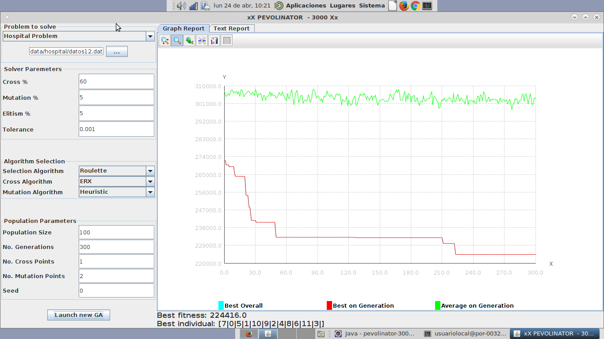

PEVOLINATOR - 3000
===============
Pedro García Castillo, Borja Lorente Escobar

Cambios Relevantes
---------

### Representación de genes

Por conveniencia, hemos incluido una representación de genes basada en enteros, lo cual facilita la creación de individuos basados en permutaciones, como se verá más adelante. Estos genes exponen una interfaz similar a los genes basados en cadenas binarias, por lo que cambiar entre representaciones es transparente para el resto del programa.

### Poblaciones combinatorias

Hemos creado nuevas funciones para crear poblaciones combinatorias que mantengan el invariante de las permutaciones. Para evitar crear individuos duplicados, hemos intentado crear individuos por bloques, teniendo en cuenta el número máximo de permutaciones que hay en un genoma de tanaño n (pseudocódigo a continuación). Por supuesto, esta función depende de la corrección de `createPermutations`, pero ésta contiene chequeos para comprobar que cada individuo generado es de hecho una permutación. La aleatoriedad de la población viene dada por la aleatoriedad del individuo base, del cual se consiguen permutaciones en orden.

  ```java
  public static Population createIntegerCombinatorics(int populationSize, int genomeSize, int seed, int n) {
        Population randomPopulation = new Population();
        Random random = new Random(seed);
        Individual base = new Individual(GenomeFactory.createRandomPermutation(genomeSize, n, random));
        int numPermutations = factorial(genomeSize);

        // Crear bloques de todas las permutaciones de un individuo
        for (int i = 0; i < populationSize / numPermutations; i++) {
            randomPopulation.insertAll(createPermutations(base, numPermutations));
        }

        // Insertar los populationSize % numPermutations individuos restantes
        int remainingPermutations = populationSize - randomPopulation.getSize();
        Population lastBatch = createPermutations(base, remainingPermutations);
        for (int i = 0; i  < lastBatch.getSize(); i++) {
          randomPopulation.addIndividual(lastBatch.getPopulation().get(i));
        }

        return randomPopulation;
    }
  ```

### Operadores adicionales

Hemos incluído los operadores requeridos de cruce y mutación, de manera que ahora se pueden seleccionar en la interfaz. Hay que denotar que no todos los operadores funcionan para todo tipo de problemas. Por ejemplo, el cruce granular de la práctica uno puede elegir puntos de cruce a mitad del gen, algo que claramente no funciona con genes basados en enteros. Los operadores añadidos son:

| Cruce | Mutación     |
| :------------- | :------------- |
| PMX       | Inserción       |
| OX        | Intercambio       |
| OX Priority Position       | Inversión       |
| OX Priority Order       | Heurística       |
| CX       | Inversión Especial    |
| ERX       |    -    |
| N Point Permutation       |     -    |


### Operadores propios

- **Cruce por Indices:** El cruce por índices consiste en tratar uno de los genes padre como lista de índices del segundo padre. Es decir, para el hijo h1 de los padres p1 y p2, el i-ésimo gen h1[i] viene dado por p2[p1[i]]. Por lo tanto, de los padres [2, 1, 3, 0] y [3, 1, 0, 2] saldrán los hijos [0, 1, 2, 3] y [0, 1, 2, 3]. El pseudicódigo sigue:

  ```java
  private Genome performIndexCross(Genome indices, Genome contents) {
      List<Gene> newGenes = new ArrayList<>();
      for (Gene g : indices.getGenes()) {
          newGenes.add(contents.getGene(g.intValue()));
      }
      return new Genome(newGenes);
  }
  ```

- **Mutación por Inserción Circular (Round Insertion):** Este método es muy similar a la Mutación por Inserción común. El único cambio es que, a diferencia de ésta, la Inserción Circular puede sobrepasar los límites del genoma al elegir un segundo punto, en cuyo caso usaría aritmética modular para determinar cual es el segundo índice a intercambiar:

  ```java
  //Pseudocódigo
  void mutateIndividual(Individual ind) {
    for (int i = 0; i < mutationPoints; i++) {
      int n = ind.numGenes();
      int from = randomBetween(0, n-1);
      int to = (from + randomBetween(0, n-1)) % n;
      ind.swapGenes(from, to);
    }
  }
  ```

Resultados
------------

### Ejecuciones Significativas

`data12.dat`:



|Varaiable | Valor |
|:------|:----|
|Cruces| 8905 |
|Mutaciones| 30000|

### Resultados significativos tras 20 ejecuciones:

Para esta sección hemos utilizado los siguientes parámetros:

|Parámetro| Valor |
|--------|-------|
|Algoritmo de selección| Ruleta|
|Algoritmo de cruce | ERX |
|Algoritmo de mutación| Mutación Heurística|
|Tam. población| 100 |
|Num. generaciones | 300|

El resto de parámetros están cogidos de los valores por defecto de la práctica anterior.

#### Resultados para el archivo `datos12.dat`:

|Mejor Fitness en Ejecución | Mejor Individuo en Ejecución |
|:--------|:----------------------------|
| 50 | [3 4 0 1 2] |
| 50 | [3 4 0 1 2] |
| 50 | [3 4 0 1 2] |
| 50 | [3 4 0 1 2] |
| 50 | [3 4 0 1 2] |
| 50 | [3 0 4 1 2] |
| 50 | [3 0 4 1 2] |
| 50 | [3 4 0 1 2] |
| 50 | [3 0 4 1 2] |
| 50 | [3 4 0 1 2] |
| 50 | [3 4 0 1 2] |
| 50 | [3 0 4 1 2] |
| 50 | [3 4 0 1 2] |
| 50 | [3 0 4 1 2] |
| 50 | [3 0 4 1 2] |
| 50 | [3 4 0 1 2] |
| 50 | [3 0 4 1 2] |
| 50 | [3 4 0 1 2] |
| 50 | [3 4 0 1 2] |
| 50 | [3 4 0 1 2] |

| Mejor Fitness | Mejor Absoluto | Peor Fitness | Peor Absoluto | Media | Desv. Estándar | 
|:-------------:|:--------------:|:------------:|:-------------:|:-----:|:--------------:|
|50       |[3 4 0 1 2 ]|50|[3 4 0 1 2 ]|50|0|

#### Resultados para el archivo `datos12.dat`:

|Mejor Fitness en Ejecución | Mejor Individuo en Ejecución |
|:--------|:----------------------------|
| 237560.0 | [3 11 9 4 7 5 2 1 8 6 0 10] |
| 233040.0 | [3 4 10 6 0 7 11 9 8 2 5 1] |
| 252472.0 | [5 9 4 1 6 3 10 8 7 0 11 2] |
| 244332.0 | [3 8 7 2 4 11 9 10 6 1 0 5] |
| 233040.0 | [3 4 10 6 0 7 11 9 8 2 5 1] |
| 224416.0 | [7 0 5 1 10 9 2 4 8 6 11 3] |
| 243490.0 | [3 0 7 8 2 4 6 10 9 1 11 5] |
| 224416.0 | [7 0 5 1 10 9 2 4 8 6 11 3] |
| 224416.0 | [7 0 5 1 10 9 2 4 8 6 11 3] |
| 245162.0 | [3 9 4 0 5 11 8 6 10 1 2 7] |
| 230704.0 | [3 4 10 2 6 9 11 8 7 5 0 1] |
| 230704.0 | [3 4 10 2 6 9 11 8 7 5 0 1] |
| 242748.0 | [3 1 0 4 11 10 8 5 6 2 9 7] |
| 233040.0 | [3 4 10 6 0 7 11 9 8 2 5 1] |
| 236006.0 | [3 8 4 1 9 2 5 7 6 0 11 10] |
| 224416.0 | [7 0 5 1 10 9 2 4 8 6 11 3] |
| 241002.0 | [3 2 9 4 7 5 0 1 8 6 11 10] |
| 247488.0 | [4 1 6 9 5 7 0 11 3 10 8 2] |
| 234788.0 | [3 11 10 2 7 5 8 1 4 6 0 9] |
| 235554.0 | [3 5 10 8 6 2 11 9 7 0 4 1] |
| 240718.0 | [7 0 11 3 2 4 10 6 9 1 8 5] |

| Mejor Fitness | Mejor Absoluto | Peor Fitness | Peor Absoluto | Media | Desv. Estándar | 
|:-------------:|:--------------:|:------------:|:-------------:|:-----:|:--------------:|
|224416.0       |[7 0 5 1 10 9 2 4 8 6 11 3 ]|252472.0|[5 9 4 1 6 3 10 8 7 0 11 2 ]|236167,2381|8149,328009|


#### Resultados para el archivo `datos15.dat`:

| Best fitness | Best individual                      |
| ------------ | ------------------------------------ |
| 398848       | [1 13 3 9 5 12 6 7 2 0 8 14 4 11 10] |
| 407266       | [0 5 4 10 7 6 8 11 3 2 12 9 14 13 1] |
| 407516       | [10 6 1 0 11 5 12 13 3 8 2 4 7 14 9] |
| 404814       | [0 7 4 5 14 12 6 1 2 11 3 13 10 9 8] |
| 406028       | [6 11 12 1 14 7 0 12 5 3 4 9 13 2 8] |
| 401298       | [14 6 13 8 3 5 0 1 9 7 10 2 12 5 11] |
| 401904       | [0 5 10 14 1 13 9 11 2 8 12 7 4 6 3] |
| 392258       | [10 8 5 14 2 1 6 9 12 0 11 7 4 13 3] |
| 391540       | [1 9 5 12 4 11 6 7 8 13 0 14 2 10 3] |
| 398886       | [1 13 12 5 4 11 6 7 8 9 0 3 2 14 10] |
| 406814       | [9 1 14 3 8 0 11 6 5 7 10 13 2 4 12] |
| 402496       | [1 0 12 9 2 3 11 7 8 4 5 10 13 14 6] |
| 406178       | [7 3 5 4 14 13 9 1 8 11 12 0 10 2 6] |
| 395764       | [3 13 8 4 5 9 6 1 12 7 0 2 14 11 10] |
| 408064       | [5 9 2 6 7 8 0 1 13 3 12 4 14 11 10] |
| 396310       | [9 5 10 14 3 6 0 12 1 8 11 7 4 13 2] |
| 404922       | [10 12 1 6 0 5 2 13 3 8 11 4 7 14 9] |
| 401582       | [7 0 4 5 14 12 11 6 8 9 3 13 10 2 1] |
| 406376       | [13 11 0 2 5 7 6 12 10 3 1 4 8 9 14] |
| 398842       | [0 8 5 4 10 11 6 13 3 12 2 1 14 9 7] |

| Mejor Fitness | Mejor Absoluto | Peor Fitness | Peor Absoluto | Media | Desv. Estándar | 
|:-------------:|:--------------:|:------------:|:-------------:|:-----:|:--------------:|
|391540       |[1 9 5 12 4 11 6 7 8 13 0 14 2 10 3]|408064|[5 9 2 6 7 8 0 1 13 3 12 4 14 11 10]|401885,3|5095,079619|
