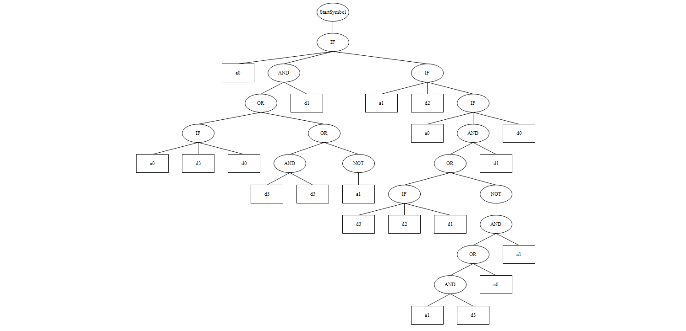
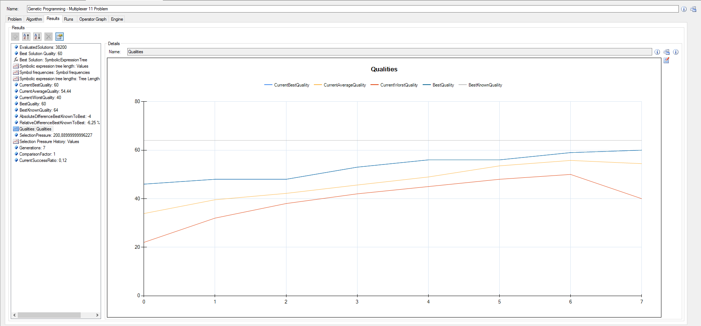
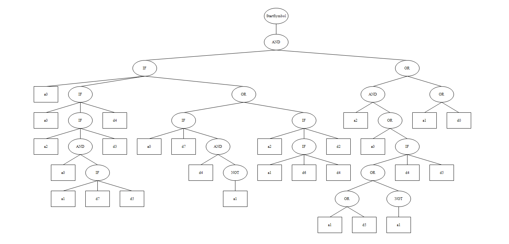
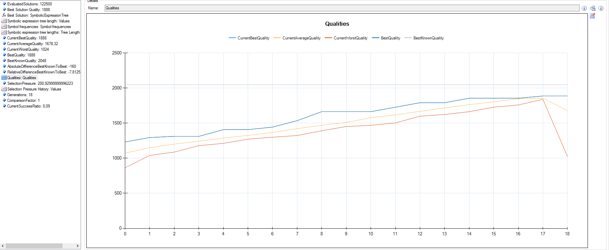

PEVOLINATOR - 3000
===============
Pedro García Castillo, Borja Lorente Escobar

Cambios Relevantes
---------

### Representación de Programa

En esta iteración del proyecto, un individuo es un programa representado por un árbol de sintaxis abstracta. Un nodo del árbol está representado por su aridad, su operador, una referencia a su padre, y una lista de nodos hijo:

```java
public abstract class Node {  
	protected String op;
	public Node parent;
	public List<Node> children = new ArrayList<Node>();

  public abstract int arity();
}
```

En el caso de los nodos no-terminales, el campo `op` denota el tipo de operación a ejecutar, mientras que en el caso de los terminales ese campo representa la variable de entrada a la que hace referencia.

Con esta representación, los operadores de cruce y mutación se implementan fácilmente como operaciones sobre punteros.

Los genomas incluyen algunas funciones útiles comunes a todos los tipos de nodos. En particular, la función `listNodes()` devuelve enumeraciones de los descendientes de ese nodo, diferenciando entre nodos no-terminales y nodos terminales:

```java
public PairTuple<List<Node>, List<Node>> listNodes();
```

### Evaluación de Aptitud

La aptitud de un programa se mide según la cantidad de resultados que difieren de los esperados de un banco de entradas de prueba, por lo que es un problema de minimización. Actualmente el banco de entradas se forma con todas las posibles combinaciones de entradas de datos y de selección.

Por cada entrada de prueba, se forma una lista de valores de entrada que luego se pasa junto al programa al evaluador de epresiones. El evaluador de expresiones recorre el árbol de sintaxis, sustituyendo las referencias a variables por los valores asignados en la lista.

```java
public static boolean evalTree(Node root, boolean[] variables, int numD) {
	switch(root.op) {
	case "NOT":
		return !evalTree(root.children.get(0), variables, numD);
	case "OR":
		return (evalTree(root.children.get(0), variables, numD)
				|| evalTree(root.children.get(1), variables, numD));
	case "AND":
		return (evalTree(root.children.get(0), variables, numD)
				&& evalTree(root.children.get(1), variables, numD));
	case "IF":
		boolean cond = evalTree(root.children.get(0), variables, numD);
		if (cond) {
			return evalTree(root.children.get(1), variables, numD);
		} else {
			return evalTree(root.children.get(2), variables, numD);
		}
	default:
		char varType = root.op.charAt(0);
		int index = Integer.parseInt(root.op.substring(1));
		if (varType == 'A') {
			return variables[numD + index];
		} else if (varType == 'D') {
			return variables[index];
		}
		throw new RuntimeException("Unrecognized variable name: " + root.op);
	}
}
```

Por último, el resultado obtenido se compara con el que obtendría un multiplexor, y se contabiliza si difieren.

### Control de Bloating

Para le control de bloating se ha utilizado la técnica Tarpeian, mediante la cual se modifica la aptitud de un individuo para descartarlo si su tamaño excede el deseable. Para esta técnica en concreto, el tamaño deseable está marcado por la media de los tamaños de los individuos, y un individuo se descarta con una probabilidad del 50% (n = 2) si su tamaño excede esta media. 

Por lo tanto, asumiendo que el tamaño medio de la población está almacenado en el campo `tamañoMedio`, y la frecuencia de poda es la constante `N`, el algoritmo de control de bloating sería el siguiente:

```java
// Procesamiento de Aptitud
// ...
// Método Tarpeian para el control de bloating
if (tamañoPrograma > tamañoMedio &&
	rand.nextInt(N) == 0) {
	// Devolver una aptitud infinitamente malo
	return numCasosPrueba + 1;
}
// Resto de procesamiento de aptitud
``` 

### Creación basada en pesos

Se ha extendido el motor de procesamiento para añadir un método propio de creación de individuos. Este método es similar a la creación completa de individuos, con la única diferencia siendo que cada nodo tiene cierta probabilidad predefinida de ser un terminal. En concreto, para cada nodo no-hoja hay una probabilidad del 20% de que sea un terminal. Este método ofrece el punto intermedio perfecto entre la creación incremental, que tiende a árboles pequeños, y la completa, que crea árboles llenos.

### Operadores implementados

Se han implementado los operadores de cruce y mutación vistos en clase, denotados por el prefijo `Tree` en la interfaz gráfica. Todos los métodos están implementados por medio de asignación de referencias en Java, ya que la estructura de los nodos permite acceder fácilmente a sus padres y modificarlos directamente con asignaciones sencillas. 

Por ejemplo, realizar un cruce de subárbol como el visto en clase implica intercambiar las referencias que los padres guardan de sus hijos originales para que apunten a los nuevos nodos, y cambiar los padres de esos nodos para apuntar a los nuevos padres:

```java
// Seleccionar los nodos a intercambiar
Node oneNode = selectNode(oneNodes);
Node otherNode = selectNode(otherNodes);

// Modificar las referencias de los padres 
// para apuntar a los nuevos hijos.
if (oneNode.parent != null) {			
	oneNode.parent.changeChild(oneNode, otherNode);
} else {
	one.root = otherNode;
}

if (otherNode.parent != null) {			
	otherNode.parent.changeChild(otherNode, oneNode);
} else {
	other.root = oneNode;
}

// Modificar la referencia de los nuevos nodos
// hacia sus padres
Node tmp = oneNode.parent;
oneNode.parent = otherNode.parent;
otherNode.parent = tmp;
```

Las mutaciones `Tree Terminal`, `Tree Operation` y `Tree Full` (mutación de terminales, de operaciones y de subárboles respectivamente) modifican el árbol de forma similar.

Resultados
------------

### Ejecuciones Significativas


Heuristic Lab executions
-------------------------

Una vez terminado con el trabajo y con las dos primeras partes hemos repetido dichos experimentos en el entorno **Heuristic Lab** de los cuales hemos obtenido los siguientes resultados. Por cada uno de los dos problemas mostramos ambos el arbol del programa que mejor resultado ha conseguido y la gráfica de las fitness en cada generación.

### Primer experimento.

   



### Segundo experimento.

   

 
